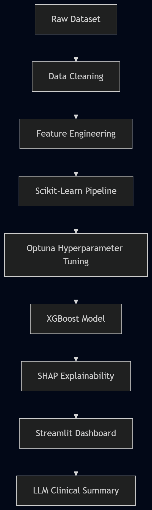
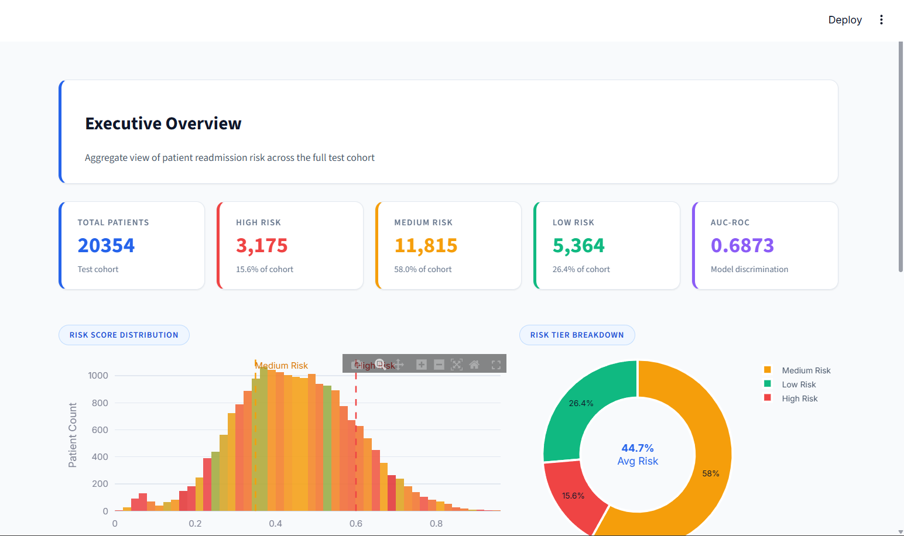
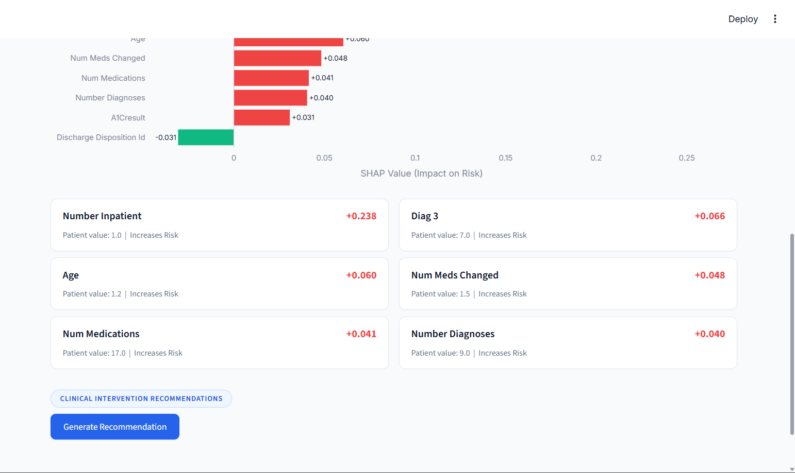
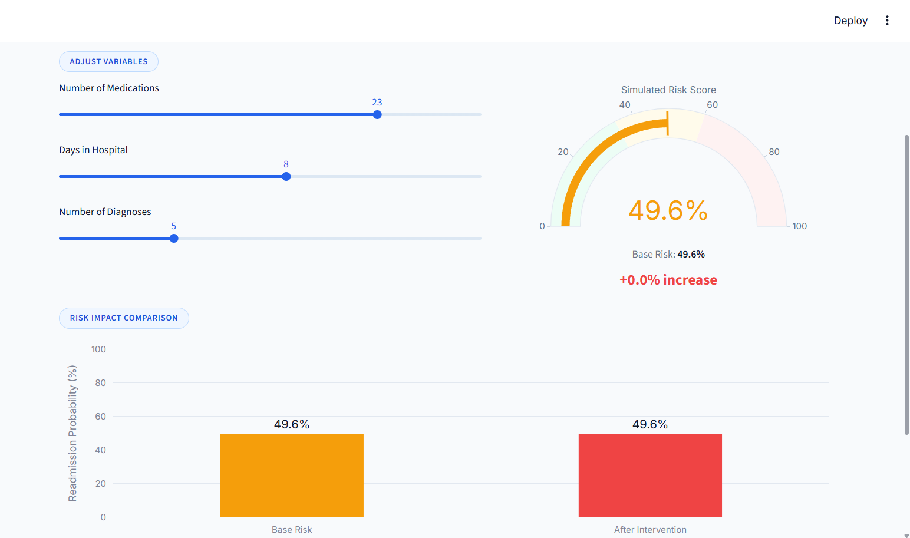
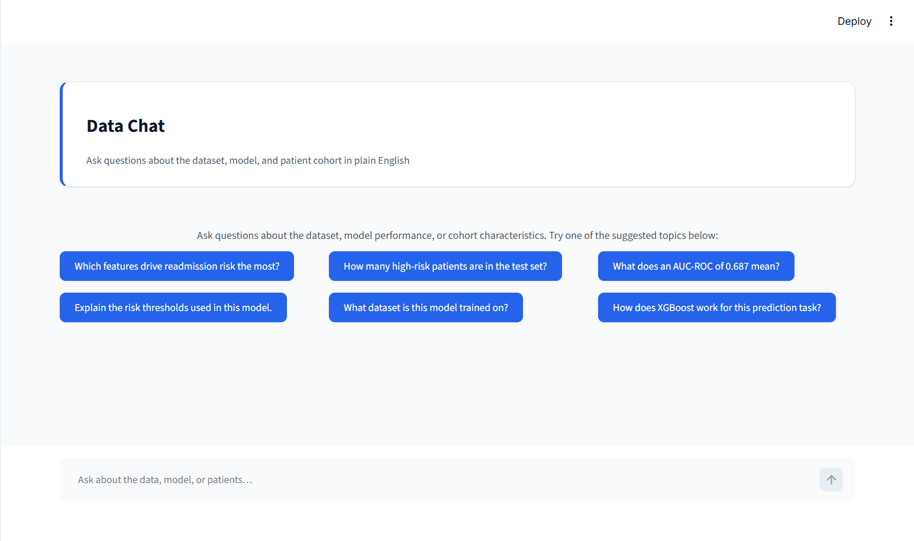

# Patient Journey & Readmission Analytics Portal

A machine learning dashboard for predicting 30-day hospital readmission risk using the Diabetes 130-US Hospitals dataset.

This project combines traditional machine learning, explainability tools, and a lightweight AI assistant to help users better understand patient risk factors and model predictions. The application was built using XGBoost, scikit-learn pipelines, SHAP, Streamlit, and the OpenAI API.
View this project here: https://patient-churn-rate.streamlit.app/
---

## Project Overview

Hospital readmissions are a major challenge in healthcare systems. The goal of this project is to analyze patient records and predict whether a patient is likely to be readmitted within 30 days after discharge.

The dashboard focuses not only on prediction accuracy, but also on explainability. Instead of showing only a risk score, the system highlights the clinical and demographic factors contributing to the prediction and provides simple natural-language summaries for easier interpretation.

---

## Features

### Machine Learning Pipeline

* End-to-end preprocessing pipeline built with scikit-learn
* Handles missing values, categorical encoding, and feature transformations
* Modular structure for easier experimentation and maintenance

### XGBoost Model with Optuna Tuning

* Trained using XGBoost for binary classification
* Hyperparameter tuning performed using Optuna
* Evaluation based on AUC-ROC and classification metrics

### SHAP Explainability

* Global feature importance analysis
* Patient-level explanations using SHAP values
* Helps identify which factors increase or decrease readmission risk

### AI Clinical Summary

* Uses OpenAI's GPT-4o-mini model
* Converts SHAP outputs and patient information into readable summaries
* Generates simple recommendations and risk explanations

### Interactive Risk Simulator

* Modify patient-related inputs such as hospital stay duration or diagnosis count
* Observe how prediction probability changes in real time

### Conversational Data Chat

* Chat interface for asking questions about:

  * model performance
  * dataset statistics
  * prediction behavior
  * patient risk patterns

---

## Tech Stack

* Python
* scikit-learn
* XGBoost
* Optuna
* SHAP
* Streamlit
* Pandas & NumPy
* OpenAI API

---

## Project Architecture



---

## Data Processing

The preprocessing pipeline includes:

* Missing value handling
* Feature scaling
* Categorical encoding
* ICD-9 diagnosis grouping
* Medication change tracking

Custom transformers were used to keep the workflow modular and compatible with the scikit-learn pipeline system.

---

## Model Training

The model is trained using XGBoost with Optuna-based hyperparameter tuning.

Main optimizations include:

* learning rate
* tree depth
* number of estimators
* subsampling ratios
* class imbalance handling

Training artifacts and evaluation metrics are saved after training.

---

## Dashboard

The Streamlit dashboard includes:

* Overall dataset insights
* Patient-level prediction analysis
* SHAP visualizations
* Risk simulation tools
* AI-generated summaries
* Interactive charts and metrics

The UI was designed to remain clean, simple, and easy to navigate.

---

## Screenshots

### Executive Overview



---

### Patient Profiler & SHAP Analysis



---

### Intervention Simulator



---

### Conversational Data Chat



---

## Installation

### 1. Clone the Repository

```bash
git clone https://github.com/your-username/patient-journey-analytics.git
cd patient-journey-analytics
```

### 2. Create Virtual Environment

```bash
python -m venv .venv
```

Activate environment:

#### Windows

```bash
.venv\Scripts\activate
```

#### Linux / macOS

```bash
source .venv/bin/activate
```

### 3. Install Dependencies

```bash
pip install -r requirements.txt
```

---

## Environment Variables

Create a `.env` file in the project root:

```env
OPENAI_API_KEY=your_openai_api_key
```

---

## Train the Model

```bash
python train.py
```

This will:

* preprocess the dataset
* run Optuna optimization
* train the XGBoost model
* save model artifacts

---

## Run the Dashboard

```bash
streamlit run app.py
```

Open:

```txt
http://localhost:8501
```

---

## Model Performance

* Dataset: Diabetes 130-US Hospitals Dataset
* Problem Type: Binary Classification
* Target: 30-day patient readmission
* Model: XGBoost
* Evaluation Metric: AUC-ROC
* Achieved AUC-ROC: ~0.65+

---

## Future Improvements

* Support for additional healthcare datasets
* Better calibration techniques
* Advanced SHAP visualizations
* Deployment support with Docker
* Multi-model comparison dashboard

---

## Disclaimer

This project is intended for educational and research purposes only. It should not be used for real-world medical decision-making or clinical diagnosis.
